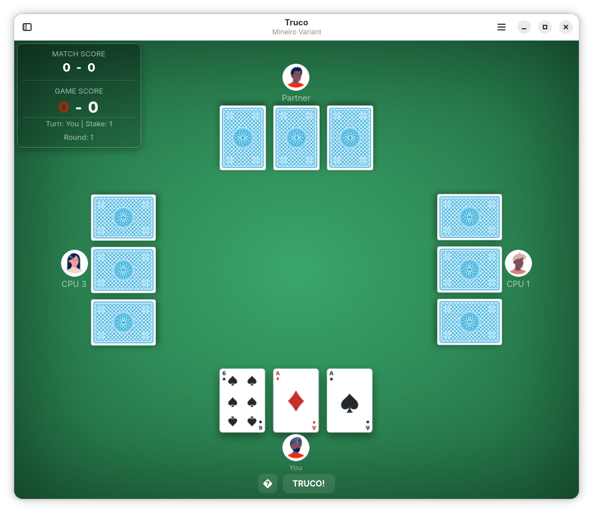

# Truco

A native GNOME version of **Truco**, the popular South American trick-taking card game played with a Spanish deck.

<div align="center">



<a href="https://flathub.org/apps/io.github.tobagin.Truco"></a>
<a href="https://github.com/sponsors/tobagin"></a>

</div>

## 🎉 Version 0.1.0 — First Release

**Truco 0.1.0** is the first public release: play the classic South American card game on GNOME, against smart CPU opponents or friends online.

### ✨ Key Features

- **🃏 Five Regional Variants**: Paulista, Mineiro, Argentino, Uruguayo, and Venezolano — each with authentic card-power rules.
- **🌐 Online Multiplayer**: Quick match, create a private room to share, or join a friend by code.
- **🤖 Smart CPU Opponents**: Distinct personalities driven by an MCTS-based decision engine.

For detailed release notes and version history, see [CHANGELOG.md](CHANGELOG.md).

## Features

### Core Features
- **Regional Variants**: Five rule sets, plus a fixed-manilha *Truco de Reis* mode.
- **Online Multiplayer**: Quick matchmaking and private room codes, always on our relay.
- **Game Mechanics**: Truco escalation (3 → 6 → 9 → 12), Envido/Flor betting, Mão de 11 and Mão de Ferro special hands, and partner signalling.

### User Experience
- **Player Profile**: First-run onboarding to pick a username and avatar, used online and on leaderboards.
- **Customizable Table**: Multiple card decks (Spanish, French, modern), table felts, and 18+ avatars.
- **History & Stats**: Match statistics and a running game-history log.

### Accessibility & Localization
- **Built-in Help**: Interactive tutorial and Mallard user help.
- **Sound Effects**: Audio feedback for cards, calls, and outcomes.
- **Six Languages**: Catalan, Spanish, French, Italian, Brazilian Portuguese, and European Portuguese.

## Screenshots

| Gameplay |
|----------|
|  |

## Building from Source

```bash
# Clone the repository
git clone https://github.com/tobagin/Truco.git
cd Truco

# Build and install development version
./scripts/build.sh --dev

# Run the application
flatpak run io.github.tobagin.Truco.Devel
```

For a production build, run `./scripts/build.sh` (installs `io.github.tobagin.Truco`).

### Build Dependencies

- `meson` (>= 0.59) and `ninja`
- `vala`
- `blueprint-compiler`
- GTK4 and libadwaita development libraries
- `libgee`, `gstreamer`, `libsoup`, `json-glib`

## Usage

### Basic Usage

1.  **New Game**: Click the menu button (☰) and select "New Game".
2.  **Online Play**: Select "Play Online" to quick match, create a room, or join one by code.
3.  **Help**: Press `F1` for the in-app rules and `Ctrl+?` for keyboard shortcuts.

### Privacy

**Truco** respects your privacy.
-   **No Telemetry**: We do not track your usage.
-   **Online Play**: Only game actions are transmitted, and only during multiplayer matches.
-   **Local Data**: Your profile, preferences, and history are stored locally on your device.

## Contributing

Contributions are welcome! Please see [CONTRIBUTING.md](CONTRIBUTING.md) for guidelines.

-   **Bug Reports**: [GitHub Issues](https://github.com/tobagin/Truco/issues)
-   **Translations**: Add your language code to `po/LINGUAS` and a `.po` file generated from `po/io.github.tobagin.Truco.pot`.

## License

Truco is licensed under the [GNU GPLv3+](LICENSE).

## Acknowledgments

-   **GNOME Project**: For the incredible platform.
-   **South American Truco Community**: For preserving the rules and regional variants.
-   **LibAdwaita**: For the beautiful UI components.
